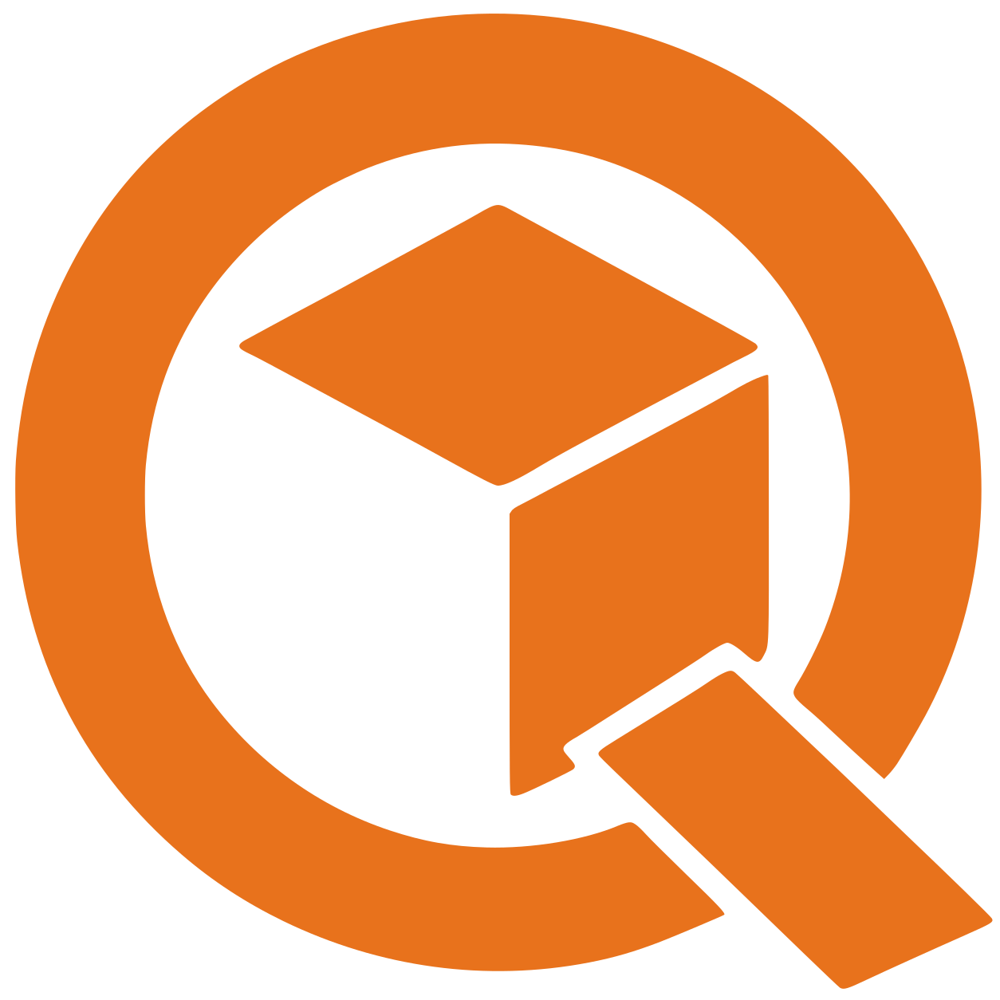
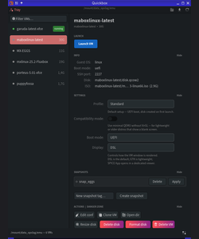
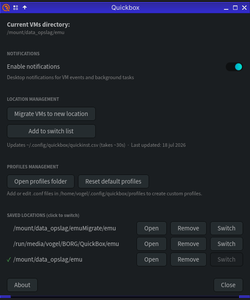
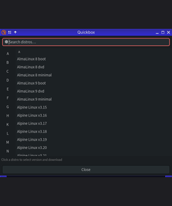
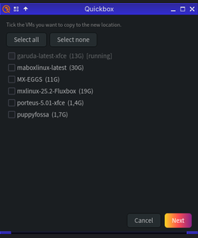
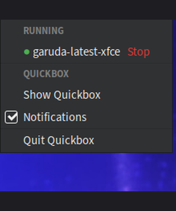
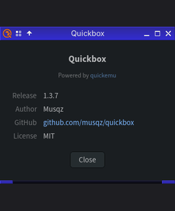

# Quickbox — GUI for quickemu

<p align="center">
  
</p>

<p align="center">
  <a href="https://github.com/musqz/quickbox/releases"></a>
  
  
  
  
</p>

A GTK4 GUI for managing QEMU virtual machines via [quickemu](https://github.com/quickemu-project/quickemu).

<table align="center">
  <tr>
    <td align="center">
      <a href="images/running.png"></a><br/>
      <sub>Main window</sub>
    </td>
    <td align="center">
      <a href="images/advanced.png"></a><br/>
      <sub>Advanced settings</sub>
    </td>
    <td align="center">
      <a href="images/download.png"></a><br/>
      <sub>Download distros</sub>
    </td>
  </tr>
  <tr>
    <td align="center">
      <a href="images/migrate.png"></a><br/>
      <sub>Migrate VMs</sub>
    </td>
    <td align="center">
      <a href="images/systray.png"></a><br/>
      <sub>System tray</sub>
    </td>
    <td align="center">
      <a href="images/about.png"></a><br/>
      <sub>About</sub>
    </td>
  </tr>
</table>

## Features

- **VM list** — browse all VMs with running status, disk size, filter by name
- **Launch / Stop** — start and stop VMs with one click
- **Snapshots** — create, apply, and delete QCOW2 snapshots
- **Clone VM** — full copy of any VM with a new name
- **Download distros** — search and download ISOs via `quickget`, with live progress
- **Custom VM** — create a VM from a local ISO or IMG file with live import progress
- **Migrate VMs** — move or copy VMs to a different directory
- **Multiple locations** — save and switch between VM directories
- **Profiles** — Standard, Lightweight, Performance, Live ISO, Server/Headless
- **Settings** — per-VM boot mode, compatibility mode, quiet launch
- **Danger zone** — Delete disk, Format disk, Delete VM (all behind confirmation dialogs)
- **System tray** — optional tray icon, hide to tray on close
- **Collapsible sections** — Info, Settings, Snapshots, Actions hide/show per preference
- **Read-only mode during import** — browse freely while an import runs, settings locked until done

## Requirements

- Python 3.8+
- GTK4 (`python3-gi`, `gir1.2-gtk-4.0`, `gobject-introspection`)
- [quickemu](https://github.com/quickemu-project/quickemu) (includes `quickget`)

## Installation

### From source (all distros)

```bash
sudo ./install.sh
```

Or manually:

```bash
sudo cp quickbox /usr/local/bin/
sudo chmod +x /usr/local/bin/quickbox
sudo cp quickbox.desktop /usr/share/applications/
```

### Arch Linux

```bash
yay -S quickbox
```

### Debian

[quickbox debian](https://github.com/musqz/quickbox/releases/tag/v1.3.7)

## Uninstallation

```bash
sudo ./uninstall.sh
```

## Usage

```bash
quickbox
```

## Configuration

Stored in `~/.config/quickbox/quickbox.conf`

Default VM directory: `~/emu/`

## GTK4 theme

To apply a theme, symlink its `gtk-4.0/gtk.css` into your config:

```bash
ln -sf /usr/share/themes/YourTheme/gtk-4.0/gtk.css ~/.config/gtk-4.0/gtk.css
```

## Credits

Quickbox is just a GUI — all the actual VM work (downloading, booting, disk handling) is done by [quickemu](https://github.com/quickemu-project/quickemu). Quickbox wouldn't exist without it.

## License

MIT — 2026 Musqz

---

> Parts of this tool were built with AI assistance (Claude by Anthropic). All code has been reviewed and tested by the author.
